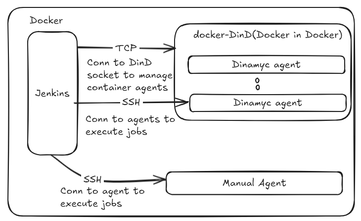

# Jenkins Lab

## Overview

This repository provides a Jenkins lab environment designed for testing and learning purposes. It allows you to experiment with Jenkins, Docker-in-Docker (DinD), and Jenkins agents in a local setup. The setup utilizes Docker Compose to simplify the process.

## Architecture

Running the provided `docker-compose.yml` file will spin up the following components in your Docker environment:

- **Jenkins Server**: A Jenkins container set up with an SSH key pair, allowing secure connections.
- **Docker-in-Docker (DinD)**: A DinD container with TLS deactivated (for testing purposes only), which enables Jenkins to manage dynamic agents using the Docker plugin.
- **Jenkins Docker Agent**: A container based on the `ssh-agent` image, which you can configure as a manual Jenkins agent for running your jobs.

Once the environment is up and running, it should resemble the following architecture:



> **Note**: This setup deactivates TLS in the DinD container for simplicity, making it **unsuitable for production** environments. Use this configuration strictly for testing purposes.

## Getting Started

1. **Clone the Repository**
    ```bash
    git clone https://github.com/yourusername/jenkins-lab.git
    cd jenkins-lab
    ```

2. **Run Docker Compose**
    ```bash
    docker-compose up -d
    ```

3. **Access Jenkins**
    Open your browser and navigate to `http://localhost:8080`

## How-To Guides

For detailed instructions on various tasks, refer to the following guides:
- [Configuring a SSH Credential](./docs/configuring-ssh-credential.md)
- [Registering a SSH Agent](./docs/registering-ssh-agent.md)
- [Creating Dynamic Agents Using Docker Plugin](./docs/creating-dynamic-agents-docker-plugin.md)